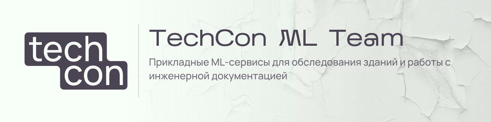
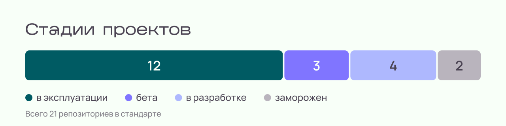
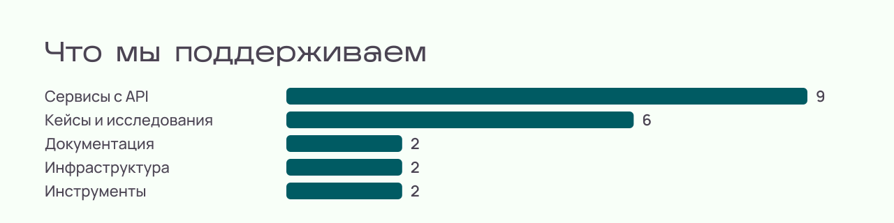

<picture>
  <source media="(prefers-color-scheme: dark)" srcset="assets/banner-dark.svg">
  
</picture>

## Кто мы и зачем это читать

Мы инженерная команда внутри [TechCon](https://techcon.ru). Делаем программы, которые берут на себя рутину обследования зданий: разбирают фотографии дефектов, голосовые заметки из поля, чертежи, технические паспорта и отчёты.

Эта страница нужна двум читателям. **Заказчику**: понять, какие задачи мы решаем и как связаться. **Кандидату**: понять, над чем работать и как у нас устроена работа.

## Что мы делаем

| Задача | Что делает программа |
|---|---|
| Дефекты по фотографии | Определяет тип дефекта на снимке конструкции и возвращает результат по API |
| Дефекты голосом | Переводит голосовую заметку из поля в структурированную запись о дефекте |
| Технические паспорта | Извлекает поля из паспорта здания и выгружает их в JSON и Excel |
| Проверка документов | Находит ошибки в сводных таблицах и отчётах обследования и объясняет, что не так |
| Поиск по техническим планам | Отбирает планы домов по признакам: регион, материал стен, этажность, площадь |
| 3D-модель по чертежам | Строит объёмную модель дома по чертежам: изображению, PDF, DWG |

Это перечень направлений, а не витрина готовых продуктов: стадия у каждого своя. Сводка по 21 репозиторию на 29.09.2026:

<picture>
  <source media="(prefers-color-scheme: dark)" srcset="assets/chart-stages-dark.svg">
  
</picture>

<picture>
  <source media="(prefers-color-scheme: dark)" srcset="assets/chart-types-dark.svg">
  
</picture>

## Как мы работаем

- **Весь цикл у себя.** Исследование, модель, API, очереди, облачная инфраструктура, мониторинг. Не передаём куски подрядчикам.
- **Документы рядом с кодом.** Контракты API, ограничения и инструкции по запуску лежат в тех же репозиториях, что и программы.
- **Изменения через ветку и проверку.** Каждое изменение проходит обзор кода и автоматические проверки.
- **По-русски.** Документацию и описания ведём на русском языке, без лишнего жаргона.

Стек: Python, FastAPI, PyTorch, Docker, Terraform, Yandex Cloud, Redis, PostgreSQL, GitHub Actions.

## Связаться

- Заказчикам и партнёрам: [techcon.ru](https://techcon.ru)
- Telegram: [@pyramidheadshark](https://t.me/pyramidheadshark)
- VK: [vk.com/pyramidheadshark](https://vk.com/pyramidheadshark)
- Почта: [pyramidheadshark@gmail.com](mailto:pyramidheadshark@gmail.com)
